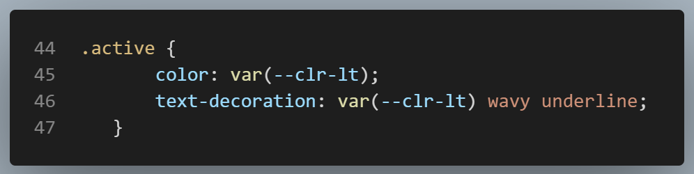

When you are on a page, it is nice to see it highlighted in the navigation bar. This is a quick little trick that adds a nice finishing touch to your website. I am using SvelteKit, and these directions apply to SvelteKit.

I have a lib folder where I store my header, footer and nav files. I am going to be working in my nav.svelte component.

## nav.svelte

- 1. In your script tag:
    
    

- 2. In your anchor element:
    
    

_&uarr; I have an array of links in my script block which consists of objects containing the title and path of each link._

- 3. Now you can add CSS to the active class and it will apply whenever you are on the page.
    
    

